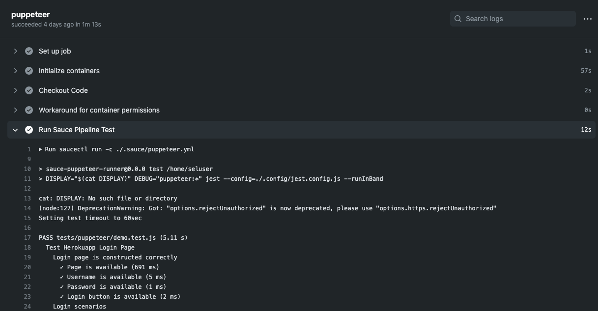

The examples on this page can be applied to virtually any deployment provided that you already have some existing automated tests, and are either the maintainer or an admin of the target repository. 

Your permissions must include:

* ability to create and manage workflows
* ability to create and store [GitHub secrets](https://docs.github.com/en/free-pro-team@latest/actions/reference/encrypted-secrets)

## What You'll Need

* [GitHub Account](https://github.com/join)
* [Sauce Labs Account](https://saucelabs.com/sign-up)

## Create GitHub Secrets

The first order of business is to export your [Sauce Labs account credentials]() and store them as GitHub Secrets.

1. Navigate to your project repository and select the __settings__ icon
    
    

2. Select __Secrets__
3. Click the __New secret__ button
4. Add the following:
    * Name: `SAUCE_USERNAME`
    * Value: 'your-sauce-username'
5. Click __Add secret__ to finish.
6. Repeat the same steps above for your `SAUCE_ACCESS_KEY` (Not sure where to find `SAUCE_USERNAME` and `SAUCE_ACCESS_KEY` in Sauce Labs? They're [here](https://app.saucelabs.com/user-settings)).

## Create the Saucectl Configuration

Create the `.sauce` directory at the root of your project and add a `config.yaml` file that points [`saucectl`](cli-reference.md) to your existing `tests` directory. 

With the `suites` field you can specify a group of tests as well as the browser `settings` you wish to use.

Below are some examples:

<!--DOCUSAURUS_CODE_TABS-->
<!--puppeteer-->

```sh
# ./.sauce/puppeteer.yml
apiVersion: v1alpha
metadata:
  name: Testing Puppeteer Support
  tags:
    - e2e
    - release team
    - other tag
  build: Release $CI_COMMIT_SHORT_SHA
files:
  - ./tests
suites:
  - name: "chrome"
    match: ".*.(spec|test).js$"
    settings:
      browserName: "chrome"
image:
  base: saucelabs/stt-puppeteer-jest-node
  version: v0.1.8
sauce:
  region: us-west-1
```

<!--playwright-->

```sh
# ./.sauce/playwright.yml
apiVersion: v1alpha
metadata:
  name: Testing Playwright Support
  tags:
    - e2e
    - release team
    - other tag
  build: Release $CI_COMMIT_SHORT_SHA
files:
  - ./tests
suites:
  - name: "chrome"
    match: ".*.(spec|test).js$"
    settings:
      browserName: "chrome"
image:
  base: saucelabs/stt-playwright-jest-node
  version: v0.1.9
sauce:
  region: us-west-1
```

<!--testcafe-->

```sh
# ./.sauce/testcafe.yml
apiVersion: v1alpha
metadata:
  name: Testing TestCafe Support
  tags:
    - e2e
    - release team
    - other tag
  build: Release $CI_COMMIT_SHORT_SHA
files:
  - ./tests
suites:
  - name: "chrome"
    match: ".*.(spec|test).js$"
    settings:
      browserName: "chrome"
image:
  base: saucelabs/stt-testcafe-node
  version: v0.1.7
sauce:
  region: us-west-1
```

<!--cypress-->

```sh
# ./.sauce/cypress.yml
apiVersion: v1alpha
metadata:
  name: Testing Cypress Support
  tags:
    - e2e
    - release team
    - other tag
  build: Release $CI_COMMIT_SHORT_SHA
files:
  - ./tests
suites:
  - name: "chrome"
    match: ".*.(spec|test).js$"
    settings:
      browserName: "chrome"
image:
  base: saucelabs/stt-cypress-mocha-node
  version: v0.1.11
sauce:
  region: us-west-1
```

<!--END_DOCUSAURUS_CODE_TABS-->

## Configure the GitHub Action

In your root project directory, create the following directory tree: `.github/workflows`. In the `workflows` directory create a file called `actions.yml`. 

In the examples below, the environment variables (`env`) equate to the values configured in GitHub secrets. The event only triggers test runs `on` every `pull_request` and/or `push` to the `master` branch.

> For more detailed information on setting event-driven actions and jobs, please visit the [GitHub Action documentation](https://docs.github.com/en/free-pro-team@latest/actions/learn-github-actions/introduction-to-github-actions#the-components-of-github-actions).

<!--DOCUSAURUS_CODE_TABS-->
<!--puppeteer-->

```sh
name: Puppeteer Pipeline Browser Tests
on:
  pull_request:
  push:
    branches:
      - master
env:
  SAUCE_ACCESS_KEY: ${{secrets.SAUCE_ACCESS_KEY}}
  SAUCE_USERNAME: ${{secrets.SAUCE_USERNAME}}
jobs:
  puppeteer:
    runs-on: ubuntu-latest
    container:
      image: saucelabs/stt-puppeteer-jest-node:latest
      options: --user 1001
     
    steps:
      - name: Checkout Code
        uses: actions/checkout@v1
        
      - name: Workaround for container permissions
        run: sudo chown -R $USER:$(id -gn $USER) /github/home

      - name: Run Sauce Pipeline Test
        run: |
          saucectl run -c ./.sauce/puppeteer.yml
        env:
          BUILD_ID: ${{ github.run_id }}
          BUILD_ENV: GitHub Actions
```

<!--playwright-->

```sh
name: Playwright Pipeline Browser Tests
on:
  pull_request:
  push:
    branches:
      - master
env:
  SAUCE_ACCESS_KEY: ${{secrets.SAUCE_ACCESS_KEY}}
  SAUCE_USERNAME: ${{secrets.SAUCE_USERNAME}}
jobs:
  playwright:
    runs-on: ubuntu-latest
    container:
      image: saucelabs/stt-playwright-jest-node:latest
      options: --user 1001
     
    steps:
      - name: Checkout Code
        uses: actions/checkout@v1
        
      - name: Workaround for container permissions
        run: sudo chown -R $USER:$(id -gn $USER) /github/home

      - name: Run Sauce Pipeline Test
        run: |
          saucectl run -c ./.sauce/playwright.yml
        env:
          BUILD_ID: ${{ github.run_id }}
          BUILD_ENV: GitHub Actions
```

<!--testcafe-->

```sh
name: TestCafe Pipeline Browser Tests
on:
  pull_request:
  push:
    branches:
      - master
env:
  SAUCE_ACCESS_KEY: ${{secrets.SAUCE_ACCESS_KEY}}
  SAUCE_USERNAME: ${{secrets.SAUCE_USERNAME}}
jobs:
  testcafe:
    runs-on: ubuntu-latest
    container:
      image: saucelabs/stt-testcafe-node:latest
      options: --user 1001
     
    steps:
      - name: Checkout Code
        uses: actions/checkout@v1
        
      - name: Workaround for container permissions
        run: sudo chown -R $USER:$(id -gn $USER) /github/home

      - name: Run Sauce Pipeline Test
        run: |
          saucectl run -c ./.sauce/testcafe.yml
        env:
          BUILD_ID: ${{ github.run_id }}
          BUILD_ENV: GitHub Actions
```

<!--cypress-->

```sh
name: Cypress Pipeline Browser Tests
on:
  pull_request:
  push:
    branches:
      - master
env:
  SAUCE_ACCESS_KEY: ${{secrets.SAUCE_ACCESS_KEY}}
  SAUCE_USERNAME: ${{secrets.SAUCE_USERNAME}}
jobs:
  cypress:
    runs-on: ubuntu-latest
    container:
      image: saucelabs/stt-cypress-mocha-node:latest
     
    steps:
      - name: Checkout Code
        uses: actions/checkout@v1
        
      - name: Workaround for container permissions
        run: sudo chown -R $USER:$(id -gn $USER) /github/home

      - name: Run Sauce Pipeline Test
        run: |
          saucectl run -c ./.sauce/cypress.yml
        env:
          BUILD_ID: ${{ github.run_id }}
          BUILD_ENV: GitHub Actions
```

<!--END_DOCUSAURUS_CODE_TABS-->

> You can reference our example workflows [here](https://github.com/saucelabs/testrunner-toolkit/tree/master/.github/workflows).

## Run the Pipeline Tests

Now when you commit these files, GitHub will detect the new workflow actions and launch `saucectl` to run your tests. 

To see the output: 

1. Log in to GitHub
2. Navigate to your repository page
3. Click on Actions

    
    
Your output may look something like this:


    
---
