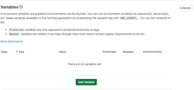
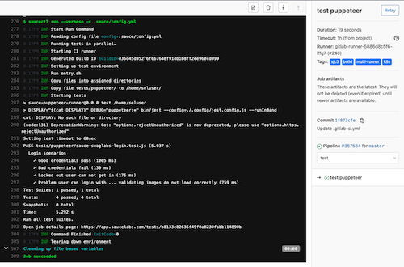

The examples on this page can be applied to virtually any deployment provided that you already have some existing automated tests, and are either the maintainer or an admin of the target repository. 

Your permissions must include:

* ability to create and manage Gitlab repositories
* ability to create and store [GitLab Environment Variables](https://docs.gitlab.com/ee/ci/variables/README.html)

## What You'll Need

* [GitLab Account](https://gitlab.com/users/sign_in)
* [Sauce Labs Account](https://saucelabs.com/sign-up)

## Set GitLab CI/CD Variables

Set your Sauce Labs account credentials as [CI/CD environment variables](https://docs.gitlab.com/ee/security/cicd_environment_variables.html) by navigating to __Settings > CI/CD__:

   

Then select __Variables__, followed by the __Add Variable__ button:

   
   
When you create the [CI/CD configuration file](#create-the-gitlab-configuration), your Sauce Labs authentication variables appear like so:

```yaml
variables:
  SAUCE_USERNAME: ${SAUCE_USERNAME}
  SAUCE_ACCESS_KEY: ${SAUCE_ACCESS_KEY}
```

## Create the Saucectl Configuration

Create the `.sauce` directory at the root of your project and add a `config.yml` file that points [`saucectl`](cli-reference.md) to your existing `tests` directory. 

With the `suites` field you can specify a group of tests as well as the browser `settings` you wish to use.

Below are some examples:

<!--DOCUSAURUS_CODE_TABS-->
<!--puppeteer-->

```yaml
# ./.sauce/puppeteer.yml
apiVersion: v1alpha
metadata:
  name: Testing Puppeteer Support
  tags:
    - e2e
    - release team
    - other tag
  build: Release $CI_COMMIT_SHORT_SHA
files:
  - ./tests
suites:
  - name: "chrome"
    match: ".*.(spec|test).js$"
    settings:
      browserName: "chrome"
image:
  base: saucelabs/stt-puppeteer-jest-node
  version: v0.1.8
sauce:
  region: us-west-1
```

<!--playwright-->

```yaml
# ./.sauce/playwright.yml
apiVersion: v1alpha
metadata:
  name: Testing Playwright Support
  tags:
    - e2e
    - release team
    - other tag
  build: Release $CI_COMMIT_SHORT_SHA
files:
  - ./tests
suites:
  - name: "chrome"
    match: ".*.(spec|test).js$"
    settings:
      browserName: "chrome"
image:
  base: saucelabs/stt-playwright-jest-node
  version: v0.1.9
sauce:
  region: us-west-1
```

<!--testcafe-->

```yaml
# ./.sauce/testcafe.yml
apiVersion: v1alpha
metadata:
  name: Testing TestCafe Support
  tags:
    - e2e
    - release team
    - other tag
  build: Release $CI_COMMIT_SHORT_SHA
files:
  - ./tests
suites:
  - name: "chrome"
    match: ".*.(spec|test).js$"
    settings:
      browserName: "chrome"
image:
  base: saucelabs/stt-testcafe-node
  version: v0.1.7
sauce:
  region: us-west-1
```

<!--cypress-->

```yaml
# ./.sauce/cypress.yml
apiVersion: v1alpha
metadata:
  name: Testing Cypress Support
  tags:
    - e2e
    - release team
    - other tag
  build: Release $CI_COMMIT_SHORT_SHA
files:
  - ./tests
suites:
  - name: "chrome"
    match: ".*.(spec|test).js$"
    settings:
      browserName: "chrome"
image:
  base: saucelabs/stt-cypress-mocha-node
  version: v0.1.11
sauce:
  region: us-west-1
```

<!--END_DOCUSAURUS_CODE_TABS-->

## Create the GitLab Configuration

In the root of your project, create a `gitlab-ci.yaml` file. Below are examples in the supported Testrunner Toolkit test frameworks:

<!--DOCUSAURUS_CODE_TABS-->
<!--puppeteer-->

```yaml
image: saucelabs/stt-puppeteer-jest-node:latest

variables:
  SAUCE_USERNAME: ${SAUCE_USERNAME}
  SAUCE_ACCESS_KEY: ${SAUCE_ACCESS_KEY}

stages:
  - test

test puppeteer:
  tags: [k8s, multi-runner, build, sjc3]
  stage: test
  script:
    - env
    - saucectl run --verbose -c .sauce/config.yml
```

<!--playwright-->

```yaml
image: saucelabs/stt-playwright-jest-node:latest

variables:
  SAUCE_USERNAME: ${SAUCE_USERNAME}
  SAUCE_ACCESS_KEY: ${SAUCE_ACCESS_KEY}

stages:
  - test

test playwright:
  tags: [k8s, multi-runner, build, sjc3]
  stage: test
  script:
    - env
    - saucectl run --verbose -c .sauce/config.yml
```

<!--testcafe-->

```yaml
image: saucelabs/stt-testcafe-node:latest

variables:
  SAUCE_USERNAME: ${SAUCE_USERNAME}
  SAUCE_ACCESS_KEY: ${SAUCE_ACCESS_KEY}

stages:
  - test

test testcafe:
  tags: [k8s, multi-runner, build, sjc3]
  stage: test
  script:
    - env
    - saucectl run --verbose -c .sauce/config.yml
```

<!--cypress-->

```yaml
image: saucelabs/stt-cypress-mocha-node:latest

variables:
  SAUCE_USERNAME: ${SAUCE_USERNAME}
  SAUCE_ACCESS_KEY: ${SAUCE_ACCESS_KEY}

stages:
  - test

test puppeteer:
  tags: [k8s, multi-runner, build, sjc3]
  stage: test
  script:
    - env
    - saucectl run --verbose -c .sauce/config.yml
```

<!--END_DOCUSAURUS_CODE_TABS-->

> For more information regarding the CI/CD configuration options provided by GitLab, please visit the [GitLab CI/CD pipeline configuration reference documentation](https://docs.gitlab.com/ee/ci/yaml/README.html).

# Run the Pipeline Tests

Now after you commit any new files to your project in GitLab, the config file detects the changes and triggers Testrunner Toolkits to run your test `stages`. 

Below is an example of a successful GitLab pipeline output:

 
 
---
