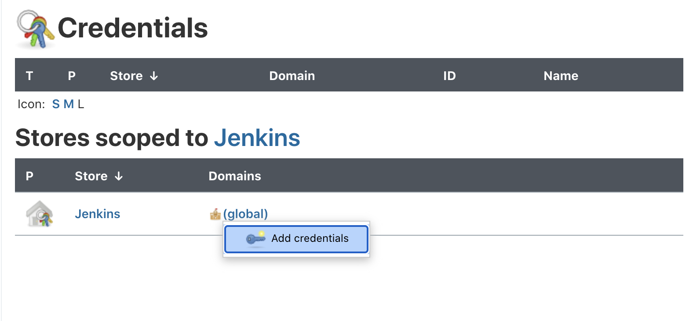
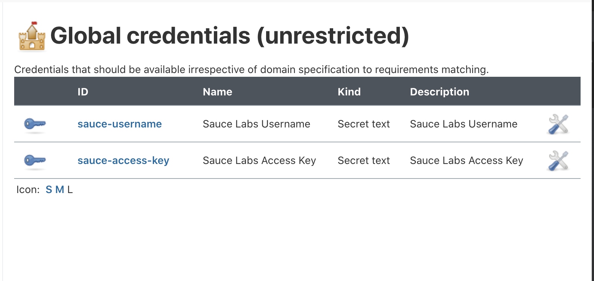

The examples on this page can be applied to virtually any Jenkins deployment provided that you already have some existing automated tests, have access to the Jenkins instance, and are either the maintainer or an admin of the target repository. 

Your permissions must include:

 * ability to create and manage Jenkins credentials
 * ability to create and manage new pipelines

## What You'll Need

* [Jenkins Server](https://www.jenkins.io/doc/book/installing/)
* [Sauce Labs Account](https://saucelabs.com/sign-up)

## Configure Jenkins Credentials

The first step of the integration is to ensure you've added your `SAUCE_USERNAME` and `SAUCE_ACCESS_KEY` as a secret file/text in your Jenkins server (Not sure where to find these? They're [here](https://app.saucelabs.com/user-settings)). 

The easiest way to add credentials to Jenkins is with the UI:

* Log in to Jenkins
* Go to __Manage Jenkins > Manage Credentials__
* Next to (Global), select __Add credentials__

     

* For __Kind__, select __Secret Text__
* Enter the following information:
    * Scope: Global
    * Secret: 'your-sauce-username'
    * ID: 'sauce-username'
    * Description: Sauce Labs Username
* Repeat the above steps for your Sauce Labs Access Key

    

    > For further information on how to store your Sauce Labs credentials in Jenkins, visit [the Jenkinsfile documentation](https://www.jenkins.io/doc/book/pipeline/jenkinsfile/#handling-credentials).

## Create the Saucectl Configuration

Create the `.sauce` directory at the root of your project and add a `config.yaml` file that points to your existing `tests` directory. 

With the `suites` field you can specify a group of tests as well as the browser `settings` you wish to use.

Below are some examples:

<!--DOCUSAURUS_CODE_TABS-->
<!--puppeteer-->

```sh
apiVersion: v1alpha
metadata:
  name: Testing Puppeteer Support
  tags:
    - e2e
    - release team
    - other tag
  build: Release $CI_COMMIT_SHORT_SHA
files:
  - ./tests
suites:
  - name: "chrome"
    match: ".*.(spec|test).js$"
    settings:
      browserName: "chrome"
image:
  base: saucelabs/stt-puppeteer-jest-node
  version: v0.1.8
sauce:
  region: us-west-1
```

<!--playwright-->

```sh
apiVersion: v1alpha
metadata:
  name: Testing Playwright Support
  tags:
    - e2e
    - release team
    - other tag
  build: Release $CI_COMMIT_SHORT_SHA
files:
  - ./tests
suites:
  - name: "chrome"
    match: ".*.(spec|test).js$"
    settings:
      browserName: "chrome"
image:
  base: saucelabs/stt-playwright-jest-node
  version: v0.1.9
sauce:
  region: us-west-1
```

<!--testcafe-->

```sh
apiVersion: v1alpha
metadata:
  name: Testing TestCafe Support
  tags:
    - e2e
    - release team
    - other tag
  build: Release $CI_COMMIT_SHORT_SHA
files:
  - ./tests
suites:
  - name: "chrome"
    match: ".*.(spec|test).js$"
    settings:
      browserName: "chrome"
image:
  base: saucelabs/stt-testcafe-node
  version: v0.1.7
sauce:
  region: us-west-1
```

<!--cypress-->

```sh
apiVersion: v1alpha
metadata:
  name: Testing Cypress Support
  tags:
    - e2e
    - release team
    - other tag
  build: Release $CI_COMMIT_SHORT_SHA
files:
  - ./tests
suites:
  - name: "chrome"
    match: ".*.(spec|test).js$"
    settings:
      browserName: "chrome"
image:
  base: saucelabs/stt-cypress-mocha-node
  version: v0.1.11
sauce:
  region: us-west-1
```

<!--END_DOCUSAURUS_CODE_TABS-->

## Configure the Jenkins Pipeline

Add the `Jenkinsfile` at the root of your project directory so that Jenkins can detect changes and run `saucectl` accordingly.
In the examples below, the `environment` variables are the GitHub secrets configured in Jenkins:

<!--DOCUSAURUS_CODE_TABS-->
<!--puppeteer-->

```sh
pipeline {
  agent {
    docker {
        image 'saucelabs/stt-puppeteer-jest-node:v0.1.8'
    }
  }
  environment {
    SAUCE_USERNAME = credentials('sauce-username')
    SAUCE_ACCESS_KEY = credentials('sauce-access-key')
    CI = true
  }
  stages {
    stage('run') {
      steps {
        // This step trigger the tests
        sh 'saucectl run -c ./.sauce/config.yml --verbose'
      }
    }
  }
}
```

<!--playwright-->

```sh
pipeline {
  agent {
    docker {
        image 'saucelabs/stt-playwright-jest-node:v0.1.9'
    }
  }
  environment {
    SAUCE_USERNAME = credentials('sauce-username')
    SAUCE_ACCESS_KEY = credentials('sauce-access-key')
    CI = true
  }
  stages {
    stage('run') {
      steps {
        // This step trigger the tests
        sh 'saucectl run -c ./.sauce/config.yml --verbose'
      }
    }
  }
}
```

<!--testcafe-->

```sh
pipeline {
  agent {
    docker {
        image 'saucelabs/stt-testcafe-node:v0.1.7'
    }
  }
  environment {
    SAUCE_USERNAME = credentials('sauce-username')
    SAUCE_ACCESS_KEY = credentials('sauce-access-key')
    CI = true
  }
  stages {
    stage('run') {
      steps {
        // This step trigger the tests
        sh 'saucectl run -c ./.sauce/config.yml --verbose'
      }
    }
  }
}
```

<!--cypress-->

```sh
pipeline {
  agent {
    docker {
        image 'saucelabs/stt-cypress-mocha-node:v0.1.11'
    }
  }
  environment {
    SAUCE_USERNAME = credentials('sauce-username')
    SAUCE_ACCESS_KEY = credentials('sauce-access-key')
    CI = true
  }
  stages {
    stage('run') {
      steps {
        // This step trigger the tests
        sh 'saucectl run -c ./.sauce/config.yml --verbose'
      }
    }
  }
}
```

<!--END_DOCUSAURUS_CODE_TABS-->

> You can view some of our public examples [here](https://github.com/saucelabs/testrunner-toolkit/blob/master/.jenkins/).

## Run the Pipeline Tests

Now you can commit these files and Jenkins will detect the new pipeline and launch `saucetl` to run your tests. 

For example if you're using the [Blue Ocean plugin](https://plugins.jenkins.io/blueocean/), your output may look something like this:


---
